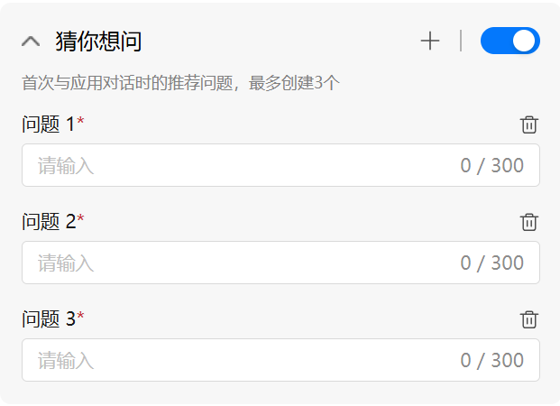

# ModelEngine

## 快速入门
### ModelEngine介绍

- 了解 AI 应用

  AI 应用是基于大模型技术构建的智能程序，能够理解、处理并响应复杂任务，实现自动化决策与交互。 我们提供一站式的可视化应用编排平台，使得从应用构建到发布的整个流程变得简单高效，甚至可以在几分钟内完成应用上线。通过直观的可视化编排工具，开发者可以利用大模型流式开发的优势，以低代码的方式快速搭建智能应用，从而大幅降低开发难度。

  通过内置的流程编排工具和声明式开发框架，开发者可以高效地组织和调度复杂的业务逻辑。平台自带丰富的功能组件，如数据处理、知识整合、模型调用和会话管理等，帮助开发者实现自动化流程，从而降低开发难度并提高迭代速度。

  开发流程：平台提供了一个高效快捷的方式来开发具有复杂交互功能的 AI 应用。 

- 一个 AI 应用的开发流程通常包括以下五个步骤：

  1. **创建 AI 应用项目**
     用户可以通过平台创建一个全新的应用项目，配置基本信息如应用名称、描述、模型选择、应用描述等。平台支持多模型、多数据源接入，开发者可根据业务场景灵活设置。

  2. **界面配置**
     平台提供直观易用的界面配置功能，开发者可快速配置应用交互界面。支持集成“猜你想问”、“多轮对话”和“创意灵感”等功能模块，增强用户交互体验。同时，内置实时调试窗口，允许开发者直接与应用进行对话测试，快速验证交互效果和逻辑正确性。

  3. **编排业务逻辑**
     借助可视化流程编排工具，用户可以通过拖拽组件的方式构建应用的执行流程。平台提供丰富的功能节点，包括模型调用、条件判断、知识库查询、变量处理、多模态等，满足复杂业务场景需求。

  4. **测试应用**
     在正式发布前，用户可在测试环境中模拟完整的交互流程，逐步查看每一个节点的输入输出结果，实时观察应用的运行状态。帮助开发者高效定位问题，优化交互逻辑和模型效果。

  5. **发布应用**
     应用调试完成后，用户可一键发布至线上环境。平台支持将应用部署为 Web 页面、API 接口等形式，便于嵌入企业系统或面向终端用户使用。同时也支持版本管理，确保应用平稳上线。

### 快速开始

  参考以下操作，创建 AI 应用项目。

  - 登录ModelEngine平台。
  - 在左侧菜单栏，单击**应用使能-应用开发**。
  - 在**应用开发**页面，单击**创建**，然后在弹出的页面，选择**创建空白应用**。
  - 输入应用名称，简介和开场白后单击**确定**。

  接下来请开始你的编辑应用流程

## 开发 AI 应用

### 我创建的应用

“我创建的应用”页面是用于集中管理用户所有开发中或已完成的应用的地方，便于统一查看、编辑和维护。在该页面中，用户可以进行以下四项操作：

- **创建空白应用**：点击“创建空白应用”后，用户需首先选择要创建的应用类型。目前支持的应用类型包括对话助手和智能体。  
  - **对话助手**：在创建对话助手时，用户需填写应用名称、应用分类、应用简介以及应用头像。系统支持两种编排方式供用户选择：
    - **基础编排**：适合初学者，提供更简洁直观的操作流程。
    - **工作流编排**：适用于有一定开发经验的进阶用户，支持更复杂的流程编排与组件配置。
  - **智能体**：在创建智能体时，用户需填写智能体的分类和简介。系统会根据用户输入的简介，自动生成一个可用的智能体原型，帮助用户快速启动开发流程。

- **导入应用**：支持从本地或其他项目中导入已有的应用配置，便于跨项目复用与协同开发。

- **导出应用**：将当前应用导出为可移植的格式，方便备份、迁移或在其他环境中部署使用。

- **删除应用**：当应用不再需要时，用户可选择将其删除，以保持项目空间的整洁与高效。

- **应用分类**：支持按“全部、通用、文章写作、编程开发、金融问数、知识问答、数字人、办公效率、企业管理”等类别对应用进行筛选，方便用户快速定位目标应用。

### 应用概览

“应用概览”是在点击应用后进入的详情页面，是用户了解和管理单个应用的重要入口。该页面主要由三个模块组成：**概览**、**分析**、**反馈**，分别对应应用的基本信息、运行数据和用户反馈等关键内容。

- **应用基本信息**：在“概览”模块中，用户可以查看该应用的核心属性，包括应用名称、是否已发布、创建者、创建时间、开场白等信息。其中开场白是用户与应用对话时最先展示的内容，用于引导用户开始互动。通过这些信息，用户可以快速判断应用的状态及定位用途。

- **公共访问URL**：该模块提供了便捷的对外访问方式，让用户可以轻松分享或嵌入自己的应用：
  - 点击“预览”按钮，可以打开一个**纯净的对话页面**，模拟用户端的真实使用体验。
  - 复制该 URL 链接可将应用分享给其他用户使用（**注意：被分享方需登录后才可与应用进行交互**）。
  - 用户还可点击“嵌入网站”，系统会自动生成一个 `iframe` 嵌入代码，便于将该应用集成到外部网站或系统中，提升应用的传播与使用范围。

- **API接口详情**：为有开发能力的用户提供了基于 API 的调用方式，方便将该应用集成进其他系统或自动化流程中：
  - 在“API密钥”区域，用户可以跳转至密钥管理页面，生成并管理用于鉴权的 API Key。
  - 点击“查阅API文档”，可以查看该应用对外开放的 API 接口说明，包括调用路径、请求参数、返回结构、错误码等，方便快速对接。

除概览模块外，页面还包含以下两个关键子模块：

- **分析**：
  - 展示与该应用相关的实时运营数据，帮助用户了解使用情况和效果评估。
  - 核心指标包括：**总请求数**、**总活跃用户数**、**平均响应时间** 等。
  - 同时提供丰富的数据图表支持，包括：
    - Top5用户图表：展示调用频率最高的用户，有助于识别核心用户群。
    - 平均响应时长图表：反映系统处理效率，有助于分析性能瓶颈。
    - 用户访问趋势图表：直观展示应用使用的时间分布和高峰期，有助于运营调度和资源优化。

- **反馈**：
  - 展示用户在使用应用过程中提交的反馈记录。
  - 每条反馈包含：**用户问题、应用回答、创建时间、服务器响应速度、反馈内容、用户操作记录**等详细信息。
  - 系统支持**按时间范围筛选反馈记录**，便于用户聚焦特定周期的使用情况。
  - 同时提供**导出功能**，支持将反馈数据批量导出用于分析或团队评审，辅助后续优化。

该页面既是开发者了解应用运行情况的重要渠道，也是持续迭代、优化用户体验的核心。

### 应用界面配置

在 ModelEngine 中，应用的界面配置能力会随着创建方式的不同逐步增强。目前支持三种应用创建方式：**对话助手 - 工作流编排**、**对话助手 - 基础编排** 和 **智能体**。每种方式所支持的界面配置能力如下所述：

#### 对话助手 - 工作流编排

支持以下界面能力：

- **开场白**：可设置在用户与应用开始对话前展示的一段欢迎语，用于营造对话氛围或引导用户提问。

- **多轮对话**：
  - 可配置是否启用对话记忆，让大模型能记住前文内容。
  - 支持设定最大对话轮次（范围 0~10），控制用户与模型连续交互的对话长度。

- **猜你想问**：
  - 可预置最多 3 条推荐问题，展示在用户首次打开应用时。
  - 这些问题会显示在对话框上方，用户点击后即可向模型提问，提升引导性和易用性。

- **创意灵感**：
  - 支持提前配置常用问题，并按一级分类管理。
  
  - 在对话界面中以“灯泡”按钮形式展示，用户点击后可快速使用这些问题，激发更多互动。

  
- **进入工作流编排**：
  - 可进一步进入工作流页面，配置更复杂的处理流程和交互逻辑。

#### 对话助手 - 基础编排

增强了模型配置与知识接入能力：

- **配置大模型**：
  - 可通过下拉菜单选择不同的大模型。
  - 支持设置“温度”参数，用于控制模型输出的随机性：
    - 温度越高，模型输出越多样化，创造性越强；
    - 温度越低，输出更保守稳定，适合严谨场景。
  - 用户可以输入提示词，并调用 AI 功能对提示词进行优化，提升应用回答质量。

- **配置知识库**：
  - 可为应用配置专属知识库，使大模型具备知识检索能力。
  - 添加知识库后，应用即可结合模型能力与知识内容，回答更精准、专业的问题。

#### 智能体

新增了**工具配置能力**，让模型具备更强的操作和执行能力：

- **工具**：
  
  - 支持将工具市场中的工具接入应用中，例如联网搜索、计算器、文件处理等。
  
  - 通过添加工具，可让智能体在对话过程中具备实际执行能力，完成更复杂的任务。
  
  - 工具的使用方式由系统自动引导，用户无需编码即可实现模型能力扩展。

    

### 工作流编排界面

在“工作流编排界面”中，用户可以通过图形化拖拽的方式，自由构建对话逻辑和处理流程，使应用具备更灵活、更智能的行为。该界面主要包括两部分内容：**基础节点** 和 **编辑工作流**。

#### 基础节点

平台提供丰富的工作流节点类型，用户可根据需求自由组合，构建出符合业务逻辑的 AI 应用。当前支持的基础节点包括：

- **大模型**：调用预设的大语言模型，实现文本生成、问答等能力。
- **代码**：编写并运行Python代码，实现自定义逻辑或数据处理。
- **条件**：设置流程判断条件，支持基于变量值进行分支逻辑跳转。
- **智能编排表单**：用于收集用户输入的结构化信息，可用于后续节点处理。
- **结束**：表示流程终止点，执行到该节点后结束本轮工作流。
- **知识检索**：对接知识库，实现基于向量或关键词的知识内容检索。
- **HTTP调用**：支持调用第三方或自有系统的 HTTP 接口，扩展外部能力。
- **变量聚合**：用于合并多个变量的值，适用于复杂的数据整理或生成响应。
- **文件提取**：支持对上传或传入的文件内容进行抽取处理，例如文本读取等。
- **注释**：用于对流程节点添加说明文字，提升可读性与协作效率。
- **循环**：实现流程的循环控制，支持遍历数组或指定次数的重复执行。
- **人工表单**：用于中断流程并等待人工输入，适合审核类或人机协作场景。

#### 编辑工作流

用户可在可视化工作区中拖拽上述节点，自由编排流程。每个节点之间通过连线进行数据与逻辑的传递，形成完整的工作链路。主要操作包括：

- 拖动节点至画布，配置节点参数（如大模型的提示词、接口地址等）。
- 使用连线连接节点，设定执行顺序和条件分支。
- 点击节点查看或修改详细配置，实时预览流程执行逻辑。
- 支持保存、测试与发布流程，确保流程行为符合预期。

工作流编排模式为中高级用户提供了强大的流程控制能力，适用于构建复杂逻辑、多轮对话、多系统联动等高阶 AI 应用场景。

### 智能表单

智能表单模块支持用户**创建、编辑和删除**自定义表单，用于收集结构化信息或驱动工作流节点配置。用户可设计适用于不同业务场景的智能表单，并在应用中复用，提升输入规范性与交互效率。

### 应用插件

应用插件模块用于管理用户自主开发的插件，支持**创建、编辑和删除**插件内容。插件可在应用或工作流中调用，扩展模型能力或集成外部系统，适用于需要个性化处理逻辑或增强功能的场景。

### 应用市场

应用市场模块用于展示用户已发布的应用，其他用户可以浏览、预览或引用这些公开应用。通过应用市场，开发者可以分享自己的成果，促进协作与复用，加快 AI 应用的推广与落地。

## 数据使能
### 数据处理
  - 数据集管理
  - 数据清洗
  - 数据标注
  - 数据评估
### 知识库
  - 向量化知识库
  - 行业术语管理
### 市场
  - 算子插件
## 模型使能
### 模型管理
  - 模型仓库
### 模型服务
  - 模型评测
  - 模型训练
  - 模型服务

## API和SDK

## 虚拟实验

## 开发部署指南

## 设置

## 账号管理

## FAQ